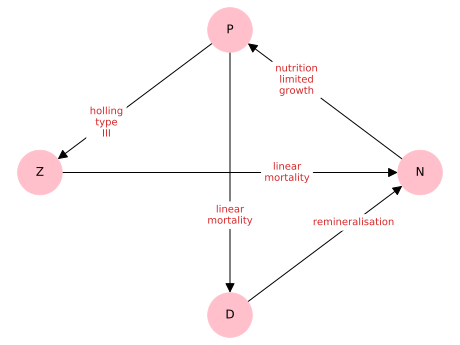
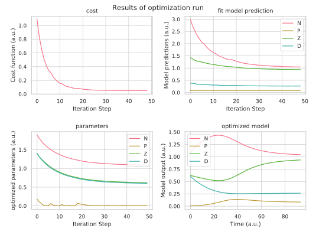

# General Ecosystem Modeling Framework

GEMF is a ecosystem modelling framework written in python.
It is designed to offer an easy to use method for modelling ecosystems with low- to intermediate complexity.
The framework offers the functionality to handle non-equilibrium, non-linear interactions.
Because of the far spread field of ecology and its research challenges, we designed the framework with flexibility in mind.
We provide a set of functions for the typical use-cases so that the framework be used without needing to write any code.
However, we made it possible for the user to define interaction functions between ecosystem components without needing to change any of the framework code.
The framework offers an easy to use method that fits any parameter of the model to mimic the studied system.
For simplicity, the current version of the framework is limited to non-spatially resolved models (box-models).
It was originally created to assist in development of a carbon flow model in the Baltic sea by Maike Scheffold


## Quick Start

See examples.py

A set of exemplary framework configurations are provided in the [configuration_files](configuration_files/)


## Use case

Assume a set of coupled ordinary differential equations.
Some parameters of this set of equations are not yet fully determined and need to be found or optimized i.e. due to measurement uncertainties.
These parameters might be i.e. initial values that reproduce a certain steady state.

This library provides a framework where a set of parameters, both initial conditions as well as ODE coefficients, can be chosen and if possible fitted in such a way that your model reaches a certain desired stable state.

Its key design feature is a high flexibility in its application.
This flexibility is provided by a design that allows users to externally define routines that can then easily be passed into the model without having to "hack" any of the actual library code.
Examples of this are i.e. the time integration method or the way the differential equations are put together.
But more importantly the way the model fits its results.
Meaning that the measure of how good the ode-system performs relative to the desired system can be provided by the user as well as the gradient descent method that is used to improve the ODE-system to achieve a better fit.
All that needs to be done by the user to achieve this, is to provide the function name to the library and make it available to the global name space of the python run-time instance.

To reduce the complexity of problem of solving and fitting ODE-systems, we require a set restriction to the problem:
* It is a system of coupled ordinary differential equation.
* The desired state is a stable state of the ODE system.
  

## How does it work?

For a conceptual description of the internals of this library, see [README_concept.md](README_concept.md)


## Usage

The designed work-flow when using this library is to first draw up a network diagram or graph that represents the system you want to study.

An exemplary graph might look like the following:


To set up the model one needs to define all the compartments (represented by nodes). The interactions between these compartments are symbolized by the directional lines (edges). Each of these edges represents a flow between compartments. The kind of interaction is labeled on each edge.
Note that this creates a directional-multi-graph. Multi in this context means that we can have several edges going back an forth (directional) between two nodes.
This step can be skipped if the ODE's of the system are already well known.

The library uses a yaml configuration file to read-in the graph structure.
This configuration file follows the same structure as the graph.
Hence, we need to define the compartments and their interactions.
Additionally, it defines what and how the model shall be fitted, plus some technical details i.e. for the time evolution of the ODE.

An exemplary configuration file might look like this:

```
states:
  N:
    optimise:
      lower: 0
      upper: 2
    value: 1.0
  P:
    optimise:
      lower: 0
      upper: 2
    value: 1.0
  [...]

interactions:
  N:P:
  - fkt: nutrition_limited_growth 
    sign: '-1'
    parameters:
    - 'N'
    - 0.27
    - 0.7
    optimise:
  [...]

configuration:
  [...]
```

For more details on the yaml file, see [README_YAML.md](README_YAML.md)


The function intended for the user are gathered in the caller module.
The main top level function is **'dn_monte_carlo()'**.
When provided with the yaml configuration file,
it fits a set of selected parameters.
This achieved by calculating the time evolution of the system and varying the parameters to get closer to the desired fit target. The varying of the parameters is done by a gradient descent approach.

The results of such a run might then look like the following:

Top left shows the cost of the current model configuration. The cost is a quadratic measure of distance to the desired model.
Top right shows a output of the ODE model after it reached its steady state for every parameter set tested, while bottem left shows the tested parameters.
Bottem right shows the full model output of the (so far) best fitted model.
Note that for illustratrive purposes, we only shoed the first few iteration steps. Ideally the cost converges to zero.


The framework provides three functions intended for the user:**dn_monte_carlo()**,**gradient_descent()**, and **run_time_evo()**. To give a short overview of the implementation: 

* After **dn_monte_carlo()** ran, it returns a set of the optimized free parameter which are or can be initially randomly chosen. Hence, the name 'monte carlo'. However, it the initial set can also be prescribed, if desired.
Additionally, it returns the value of the cost function, the prediction of the fit model, as well as the full ode-model output for the final parameter set as well as all intermediate steps.

* dn_monte_carlo()  calls the **gradient_descent()** function which does the actual optimization and is therefore responsible for most of the heavy lifting concerning the fitting in this library.
For a given set of initial free parameters (among many other input parameters), an optimized set is returned, based on the gradient descent approach starting from the initial set.

* The last top level function is the **run_time_evo()** on which the gradient_descent() routine heavily relies on. It does the time integration of the system of ODEs and by doing so tests the influence of the free parameter.
