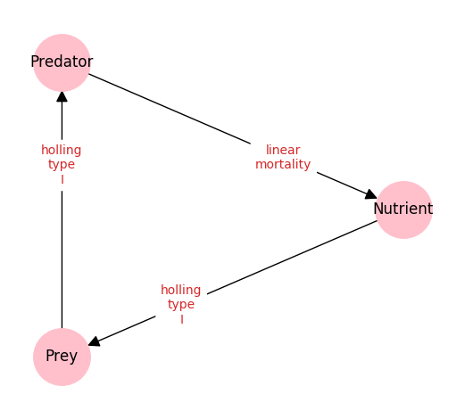
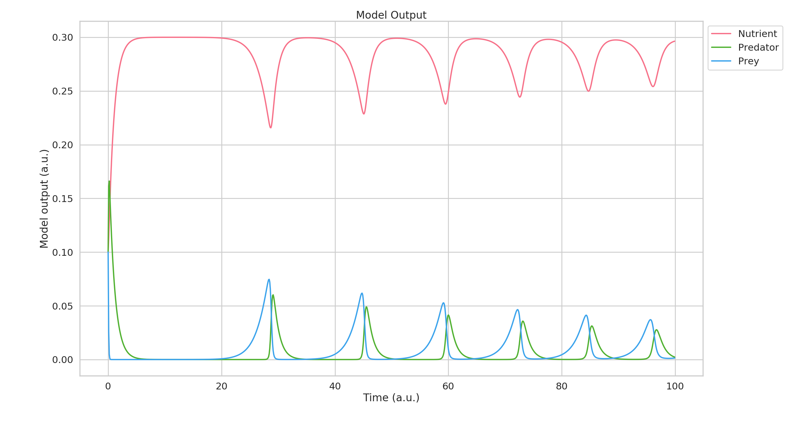
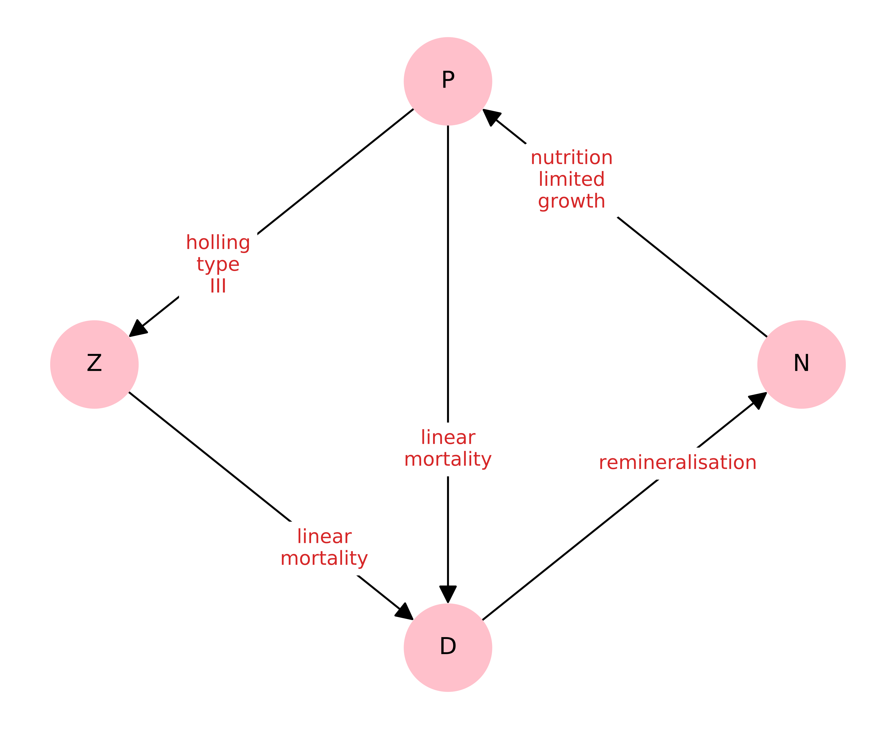
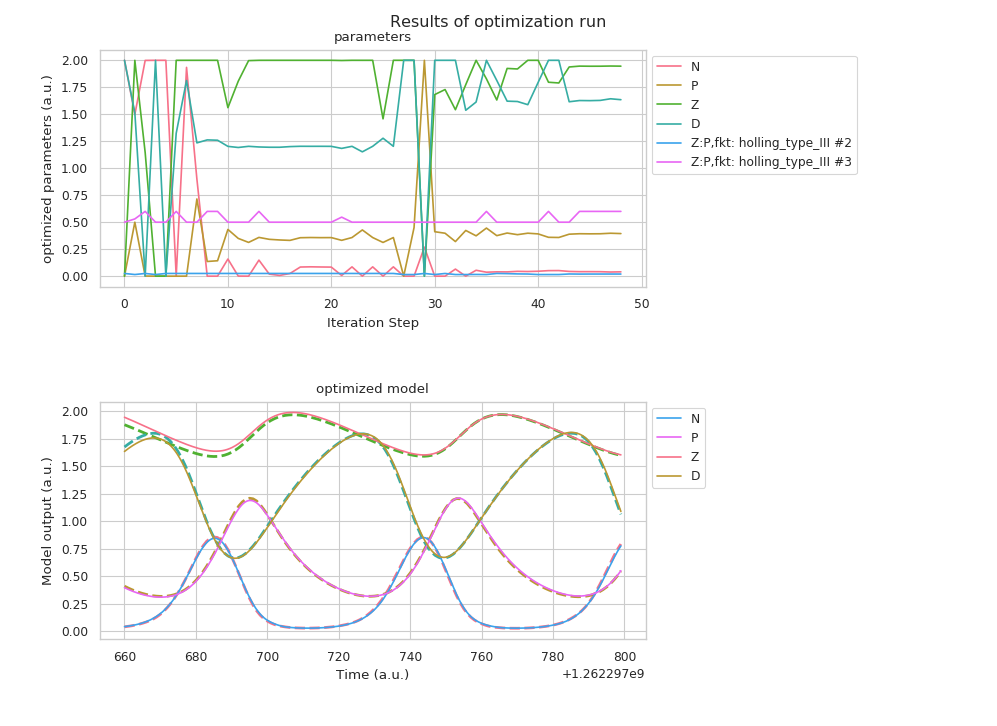

Examples
========

We will present some small examples in full to show what the model can
be used for and how.

Predator-Prey
-------------

The probably most famous ecosystem model is the so called
“Lotka-Volterra” model. It has been developed in the 1920s and was
designed to described the population dynamics of hares and lynxes. It is
described by the following set of equations,

.. figure:: https://wikimedia.org/api/rest_v1/media/math/render/svg/eba353633616971f427b13e175bfbdb1b99bcff0
   :alt: eq:Lotka_Volterra

where *x* and *y* represent the predator and prey populations, while the
remaining variables are constants.

While famous, this minimalistic predator-prey model is not “closed”.
Hence, it implicitly depends on external compartments, most importantly
nutrients for the prey. We present a closed extension of this model,
where the predator dies, is transformed in some form of nutrient and
consumed by the prey.

The interaction graph of this model is presented below.

This graph is generated by the NEMF framework base on the following
*YAML-configuration-file*:

.. code:: yaml

   # List of all present compartments in the model.
   compartment:
     Nutrient:
       value: 0.1
       optimise:
     
     Predator:                       # name of the compartment
       value:  0.1                   # initial value of the compartment
       optimise:                     # if the above value shall not be optimized,
                                     #this remains empty
     Prey:
       value: 0.1
       optimise:

   # List of all interactions/flows between compartments
   interactions:
     Prey:Nutrient:                  # names of the interacting compartments
     - fkt: holling_type_I           # name of the type of interaction 
       parameters:                   # list of parameters required for interaction
       - 'Nutrient'                  # Parameters can also be other compartments
       - 2
       optimise:                     # whether or not some of these parameters
                                     # shall be optimized
     Predator:Prey:
     - fkt: holling_type_I
       parameters:
       - 'Prey'
       - 100

     Nutrient:Predator:
     - fkt: linear_mortality
       parameters:
       - Predator
       - 1
       
   # list of details for the forward and inverse modelling modules
   configuration:
     # time evolution / forward modelling
     time_evo_max: 100
     dt_time_evo: 0.1

You can read more about the *YAML configuration file*
`here <manual/YAML.md>`__.

To create the graph and also calculate a forecast/time-evolution of the
model we execute the following lines of code:

.. code:: python

   import nemf

   # provide the path of model/system configuration
   model_path = 'path/to/the/yaml/file/presented/above/example.yml'

   # load the model configuration
   model = nemf.load_model(model_path)

   # visualise the model configuration to check for errors
   nemf.interaction_graph(model)

   # for a time evolution of the model call:
   output_forward = nemf.forward_model(model)

   # the results of the time evolution can be visualized with:
   nemf.output_summary(output_forward)

To read more about the functions present in the NEMF framework, take a
look at the `API references <api.rst>`__.

This generates both the graph as shown above, and also the following
time-evolution of the model: |plot:timeevo_LV|

NPZD-Model (Nutrient-Phytoplankton-Zooplankton-Detritus)
--------------------------------------------------------

The simple Predator Prey example presented the fundamentals of the
Framework. In the NPZD example used in the
`introduction <introduction.md>`__ we also presented the inverse- or
fitting-capabilities of the framework which we will present now.

The model interaction graph looks like this: |graph:NPZD|

This model is a little more complicated. Hence, the configuration file
will also be a little longer.

Note especially how we declare which parameters shall be fitted and the
range in which the fitted value shall remain.

.. code:: yaml

   # List of all present compartments in the model.
   compartment:
     N:              # name of the compartment
       value:  1     # initial value of the compartment
       optimise:     # if the above value shall not be optimized this remains empty
         lower: 1.0e-9    # if not, lower and
         upper: 2         # upper constraints must be defined 
     P:
       value: 1 #.20835024e+00
       optimise:
         lower: 1.0e-9
         upper: 2
     Z:
       value: 1 #8.84333950e-01
       optimise:
         lower: 1.0e-9
         upper: 2
     D:
       value: 1 # 8.57333742e-01
       optimise:
         lower: 1.0e-9
         upper: 2

   # List of all interactions/flows between compartments
   interactions:
     
     P:N:                            # names of the interacting compartments
     - fkt: nutrient_limited_growth  # name of the type of interaction 
       parameters:                   # list of parameters required for interaction
       - 'N'                         # Parameters can also be other compartments
       - 0.27
       - 0.7
       optimise:                     # whether or not some of these parameters
                                     # shall be optimized
     Z:P:
     - fkt: holling_type_III
       parameters:
       - 'P'
       - 0.02
       - 0.575 
       optimise:
         - parameter_no: 2
           lower: 0.015
           upper: 0.025
         - parameter_no: 3
           lower: 0.5
           upper: 0.6
     D:P:
     - fkt: linear_mortality
       parameters:
       - 'P'
       - 0.04
       optimise:
     D:Z:
     - fkt: linear_mortality
       parameters:
       - 'Z'
       - 0.01
       optimise:
     N:D:
     - fkt: remineralisation
       parameters:
       - 'D'
       - 0.148
       optimise:

   # list of details for the forward and inverse modelling modules
   configuration:
     # time evolution / forward modelling
     time_evo_max: 1000
     dt_time_evo: 1

For the framework to fit we also need a date set to be used. It will
then try to find a model configuration (in the allowed constraints) that
lies closest to the reference data points.

For our example we use the following data set:

.. code::

   'Datetime','N','P','Z','D'
   1.262297670e+09,1.51e-01,3.15e-01,1.74e+00,1.79e+00
   1.262297681e+09,7.22e-01,4.97e-01,1.60e+00,1.17e+00
   1.262297692e+09,5.23e-01,1.13e+00,1.66e+00,6.69e-01
   1.262297703e+09,4.98e-02,9.03e-01,1.94e+00,1.09e+00
   1.262297714e+09,2.82e-02,4.97e-01,1.93e+00,1.54e+00
   1.262297725e+09,8.95e-02,3.29e-01,1.79e+00,1.79e+00
   1.262297736e+09,5.07e-01,3.92e-01,1.64e+00,1.45e+00
   1.262297747e+09,7.57e-01,9.44e-01,1.60e+00,6.88e-01
   1.262297758e+09,9.99e-02,1.07e+00,1.89e+00,9.35e-01
   1.262297769e+09,2.52e-02,5.88e-01,1.95e+00,1.42e+00
   1.262297780e+09,5.41e-02,3.58e-01,1.83e+00,1.74e+00
   1.262297791e+09,3.04e-01,3.30e-01,1.68e+00,1.67e+00

Read more about the reference data format
`here <manual/reference_data.rst>`__.

To tell the framework to perform a fitting-run we execute the following
small script. It will also generate the interaction graph above and will
draw a plot presenting the result.

.. code:: python

   import nemf

   # provide the path of model/system configuration
   model_path = 'path/to/the/yaml/file/presented/above/example.yml'
   reference_data_path = 'path/to/the/data/file/representing/the/model_ref.csv'

   # load the model configuration
   model = nemf.load_model(model_path,reference_data_path)

   # visualise the model configuration to check for errors
   nemf.interaction_graph(model)

   # for a simple time evolution of the model call:
   output_forward = nemf.inverse_model(model)

   # the results of the time evolution can be visualized with:
   nemf.output_summary(output_forward)

which will create the following plot: |plot:NPZD_fit|

In the top you can see the different set tested during the fitting
process. The bottom half shows the “fitted” model time evolution, which
represents the frameworks best guess for the parameters. The reference
data points are shown as dashed lines.

Enzymatic Reaction
------------------

[placesholder]

