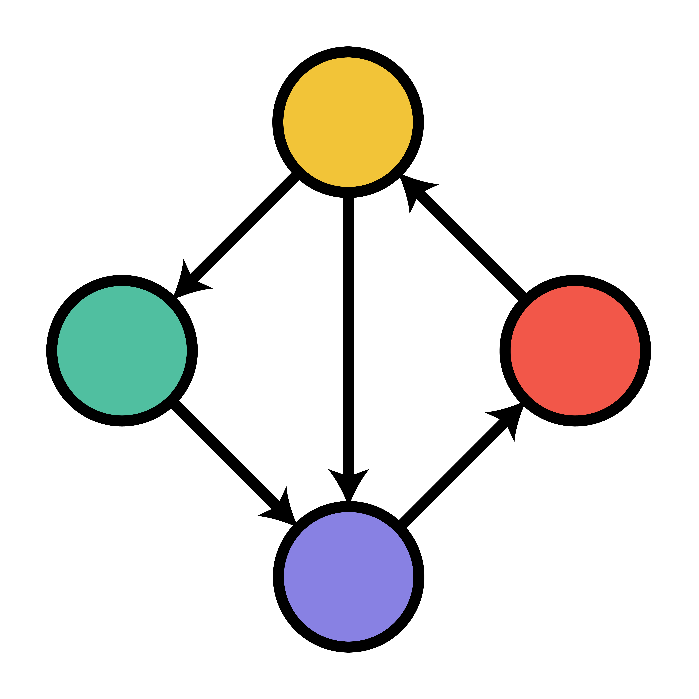
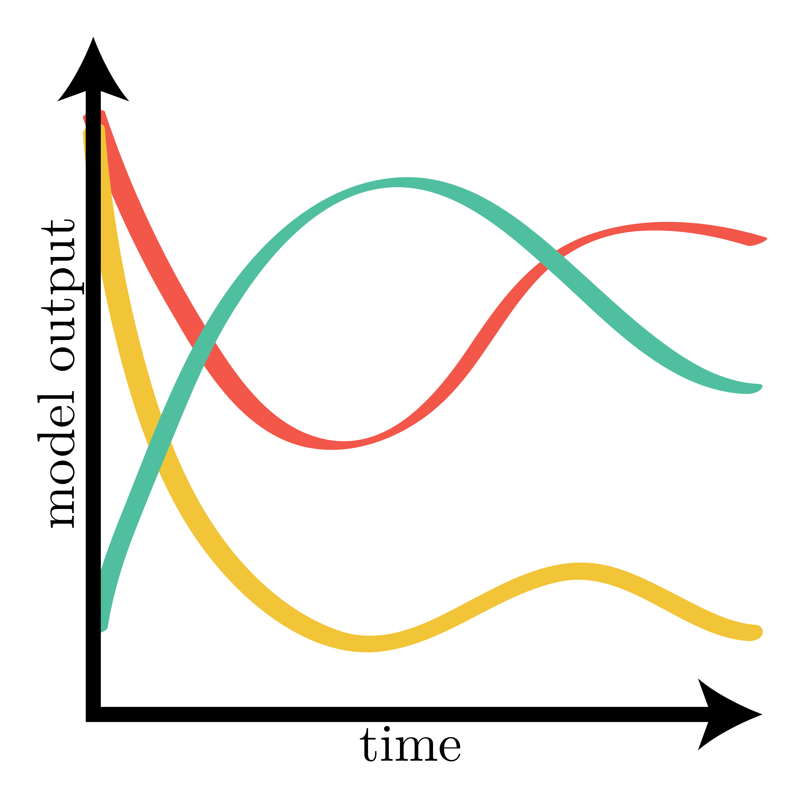
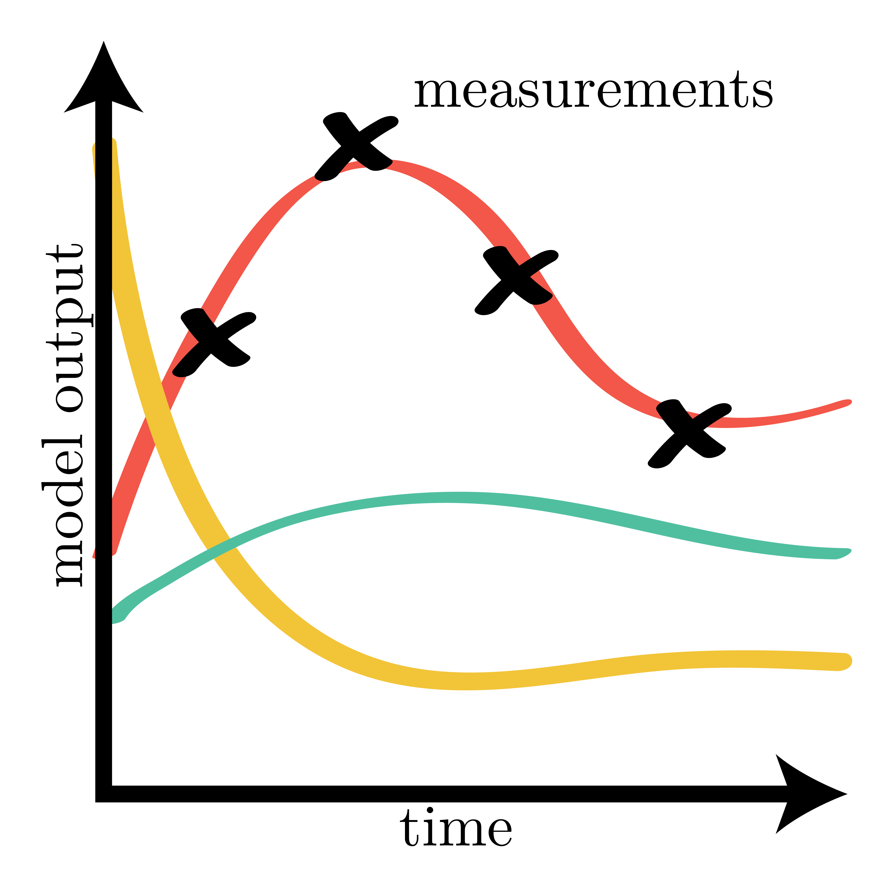

.. nemf documentation master file, created by
   sphinx-quickstart on Tue May 26 14:51:46 2020.
   You can adapt this file completely to your liking, but it should at least
   contain the root `toctree` directive.

Network-based Ecosystem Modeling Framework (NEMF)
=================================================

NEMF is a ecosystem modelling framework written in python.
It is designed to offer an easy to use method for modelling ecosystems with 
low- to intermediate complexity. It consists of three conceptual parts:

|fig1| |fig2| |fig3|

1. *Network-based model description*
2. *Forward modelling*
3. *Inverse modelling*  

   (For details see :doc:`Introductory notes<introduction>`.)

The framework offers the functionality to handle *non-equilibrium*, 
*non-linear interactions*.
For the typical use-cases, user do need to write any code but only provide a 
model configuration.

The range of use-cases can easily be extended with simple 
:doc:`user-written functions<manual/interaction_functions>` without needing to 
change any of the framework code.
NEMF offers an easy to use method to *fit any model parameter* such that the 
model mimics the studied system.

For simplicity, the current version of the framework is limited to 
*non-spatially resolved models* (box-models).

For a brief introduction to the ideas behind this library, 
you can read the :doc:`introductory notes <introduction>`.
A more detailed description can be found in the :doc:`paper <paper>`.
Visit the :doc:`installation page <installation>` to see how you can download 
the package. 
You can browse the :doc:`examples <examples>` to see what you can do with NEMF.
A more detailed description of the parts the library can be found in the
:doc:`manual <manual>`,
while the code is documented in the :doc:`API reference <api>` section.

To see the code, please visit the `github repository
<https://github.com/465b/nemf>`_.
To report a bug, please raise a 'Issue' in `githubs issue tracker
<https://github.com/465b/nemf/issues>`_.
Please feel free to contact laurin.steidle@uni-hamburg.de with general 
issues (i.e. if the installation fails).

.. toctree::
   :maxdepth: 1
   :caption: Contents:

   Introduction <introduction.rst>
   examples.rst
   Paper <paper>
   installation.md
   manual.rst
   api.rst
   releases.md