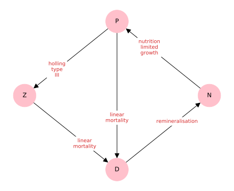

# An introduction to NEMF

The network-based ecosystem modelling framework (NEMF) is a framework for 
general ecosystem modelling problems.
It consists of three conceptual parts:

1. *Network-based model description*
2. *Forward modelling*  
   (By this we mean, numerically solving the differential equations implicitly defined by the 
   network. Hence, providing forecasts how the model behaves.)
3. *Inverse modelling*  
   (Meaning the fitting of model forecasts to observational or other reference 
   data.)

It aims to keep the configuration complexity minimal for the user such that it 
can be quickly learned and applied for i.e. rapid prototyping of model ideas.
To keep configuration and computational complexity low it can only applied to 
non-spatially-resolved, also known as box-models.

### Network and Forward

An example of what we mean by that:
```python
import nemf
model = nemf.load_model('exemplary_npzd_model.yml')
nemf.interaction_graph(model)
results = nemf.forward_model(model)
nemf.output_summary(results)
```

| Network visualisation | Model Forecase |
|-----------------------|----------------|
|  |  |
* [placeholder: network, time evolution]


Let's go through the lines one by one to see what happened:

1. First we imported the nemf python library. 
   ```python
   import nemf
   ```
   This tells python that we want to 
   us this library and because not stated otherwise that we will address it as 
   *nemf*

2. We tell the nemf library which model we want to use.
   ```python
   model = nemf.load_model('exemplary_npzd_model.yml')
   ```
   Models are typically defined in an extra file.
   This file contains the description of the model in a humon-readable standard
   called YAML. Hence, the file extension *.yml*
   More on the yml standard  and how it is used to define models can be found
   *here* [placeholer]

3. We visualize the network defined in the model, as shown in the left figure.
   ```python
   nemf.interaction_graph(model)
   ```
   NEMF offers the option to draw up the network defined in the model 
   configuration.
   This is helps to catch errors that might have happened during the 
   configuration and gives a nice overview over the model.
   Each knot represents a compartment in the model, i.e. population of chemical 
   quantities. The arrows between them show what flows from one compartment to 
   another while the label on the arrow describes how it does that.

4. We solve the differential equations underlying the model numerically with:
   ```python
   results = nemf.forward_model(model)
   ```
   The network with its flows between compartments implicitly defines a set of 
   differential equation that couples the compartments to each other.
   The framework solves these differential equations to give a forecast how the 
   model is expected to evolve over time.

5. The result of the forecasting are visulized by calling:
   ```python
   nemf.output_summary(results)
   ```
   This is shown in the right hand side figure above.
   Each line represents one compartment and how its associated quantity (i.e. a 
   population size) changes over time.

### Model description via YAML configuration
* [placeholder]

### Inverse modelling
So far, we covered the first two aspect; the network-based approach and the 
forward modelling.

[placeholder]